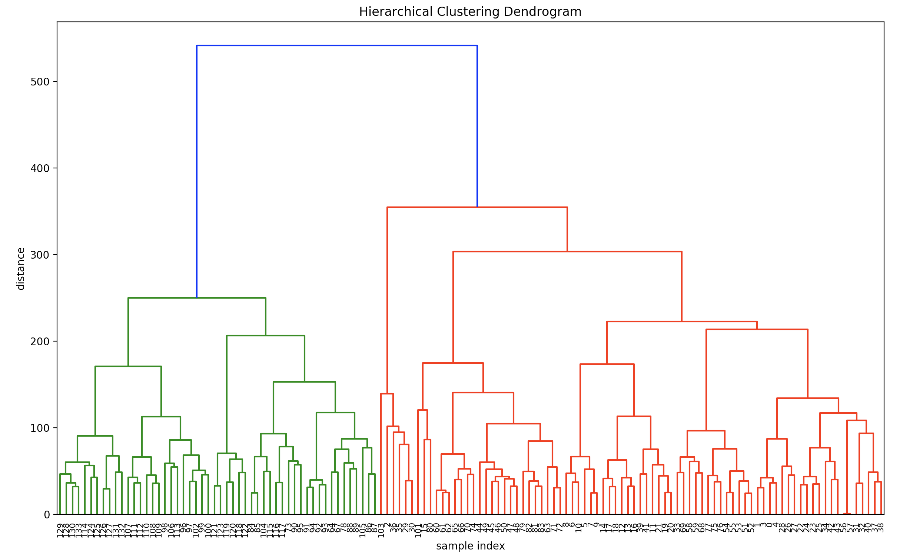
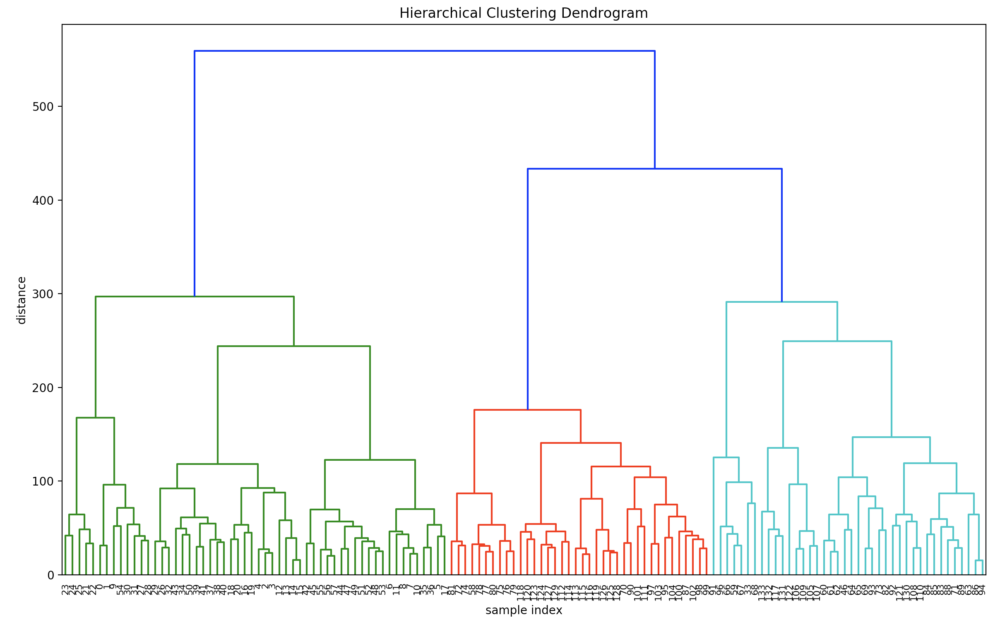

# Actions-Synchronization-with-Dynamic-Time-Warping
 Synchronization of videos in which the actor performs the same action: in particular sports videos including pole vault and dives
 
 

### Idea:
- Extract for each video of a class the features (poses of the actors) with Mask R-CNN.
- Create a matrix of video distances of a class.
- Apply a hierarchical clustering algorithm based on the distances matrix to understand which pairs apply dynamic time warping.
- For each level of the resulting tree (Dendrogram) it is possible to reproduce subtree videos in a synchronized way.

### To run:
- Download the videos from [the google drive link on this page](https://drive.google.com/file/d/1o2l6nYhd-0DDXGP-IPReBP4y1ffVmGSE) and put them in the video folder.
- Choose which subtree to synchronize from the dendrogram and the childs table.

### Pole vault Dendrogram

### Diving Dendrogram

